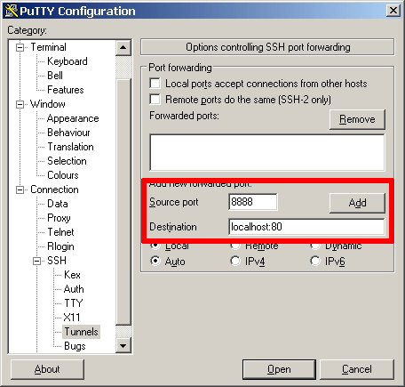
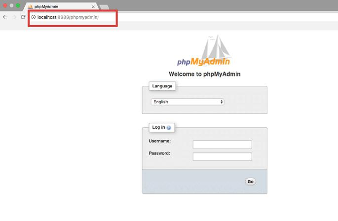
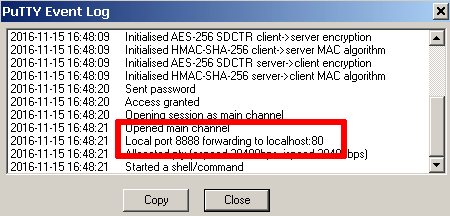
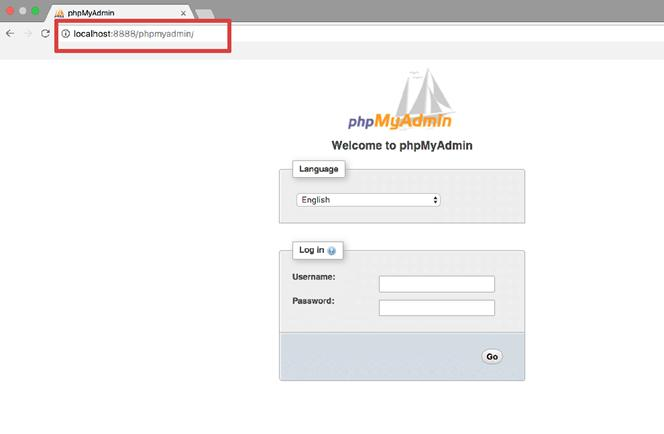

# Connect To PhpMyAdmin

For security reasons, phpMyAdmin is accessible only when using 127.0.0.1 as the hostname. To access it from a remote system, you must create an SSH tunnel that routes requests to the Web server from 127.0.0.1. This implies that you must be able to connect to your server over SSH in order to access these applications remotely.

**IMPORTANT: Before following the steps below, ensure that your Web and database servers are running.**

*NOTE: The steps below suggest using port 8888 for the SSH tunnel. If this port is already in use by another application on your local machine, replace it with any other port number greater than 1024 and modify the steps below accordingly. Similarly, if you have enabled Varnish (TM) or HTTPS redirection, your stack’s Web server might be accessible on port 81 (Varnish (TM)) or port 443 (SSL). In this case, modify the steps below to use ports 81 or 443 respectively instead of port 80 for the tunnel endpoint.*

> Access PhpMyAdmin On Windows

*Watch the following video to learn how to easily access phpMyAdmin on Windows through an SSH tunnel:*

In order to access phpMyAdmin via SSH tunnel, you need an SSH client. In the instructions below we have selected [PuTTY](https://www.chiark.greenend.org.uk/~sgtatham/putty/latest.html), a free SSH client for Windows and UNIX platforms. The first step is to configure PuTTY. [Find out how to configure PuTTY](https://docs.bitnami.com/aws/faq/get-started/connect-ssh/#connect-with-an-ssh-client).

Once you have your SSH client correctly configured and you have confirmed that you can successfully access your instance using SSH, you need to create an SSH tunnel in order to access phpMyAdmin. Follow these steps:

> In the “Connection -> SSH -> Tunnels” section, add a new forwarded port by introducing the following values:

1. *Source port*: 8888

2. *Destination*: localhost:80

> Remember that if you are redirecting HTTP requests to the HTTPS port, you must use destination port 443 instead of 80.

This will create a secure tunnel by forwarding a port (the “destination port”) on the remote server to a port (the “source port”) on the local host (127.0.0.1 or *localhost*).

·     Click the “Add” button to add the secure tunnel configuration to the session. You’ll see the added port in the list of “Forwarded ports”.

* In the “Session” section, save your changes by clicking the “Save” button.
*    Click the “Open” button to open an SSH session to the server. The SSH session will now include a secure SSH tunnel between the two specified ports.
*  Access the phpMyAdmin console through the secure SSH tunnel you created, by browsing to *http://127.0.0.1:8888/phpmyadmin*.
*   Log in to phpMyAdmin by using the following credentials:
*  Username: *root*
*  Password: application password. (Refer to our [FAQ](https://docs.bitnami.com/aws/faq/get-started/find-credentials/) to learn how to find your application credentials). Here is an example of what you should see:

If you are unable to access phpMyAdmin, verify that the SSH tunnel was created by checking the PuTTY event log (accessible via the “Event Log” menu):

**Access PhpMyAdmin On Linux And MacOS**

*To access the application using your Web browser, create an SSH tunnel, as described below.*

- Open a new terminal window on your local system (for example, using “Finder -> Applications -> Utilities -> Terminal” in macOS or the Dash in Ubuntu).

- Make sure that you have your [SSH credentials (*.pem* key file)](https://docs.bitnami.com/aws/faq/get-started/connect-ssh/#obtain-ssh-credentials) in hand.

- Run the following command to configure the SSH tunnel using the SSH key file. Remember to replace KEYFILE with the path to your private key and SERVER-IP with the public IP address or hostname of your server:

- ssh -N -L 8888:127.0.0.1:80 -i KEYFILE bitnami@SERVER-IP

**Remember that if you are redirecting HTTP requests to the HTTPS port, you must use destination port 443 instead of 80.**

> NOTE: If successful, the above command will create an SSH tunnel but will not display any output on the server console.

- Access the phpMyAdmin console through the secure SSH tunnel you created, by browsing to *http://127.0.0.1:8888/phpmyadmin*.

- Log in to phpMyAdmin by using the following credentials:

- Username: *root*

- Password: application password. (Refer to our [FAQ](https://docs.bitnami.com/aws/faq/get-started/find-credentials/) to learn how to find your application credentials).

Here is an example of what you should see:

 
